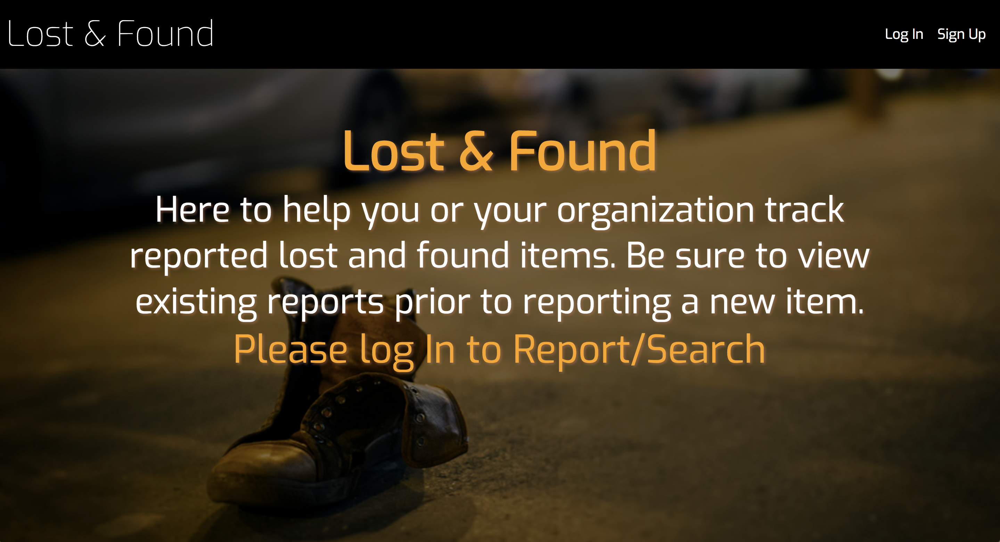
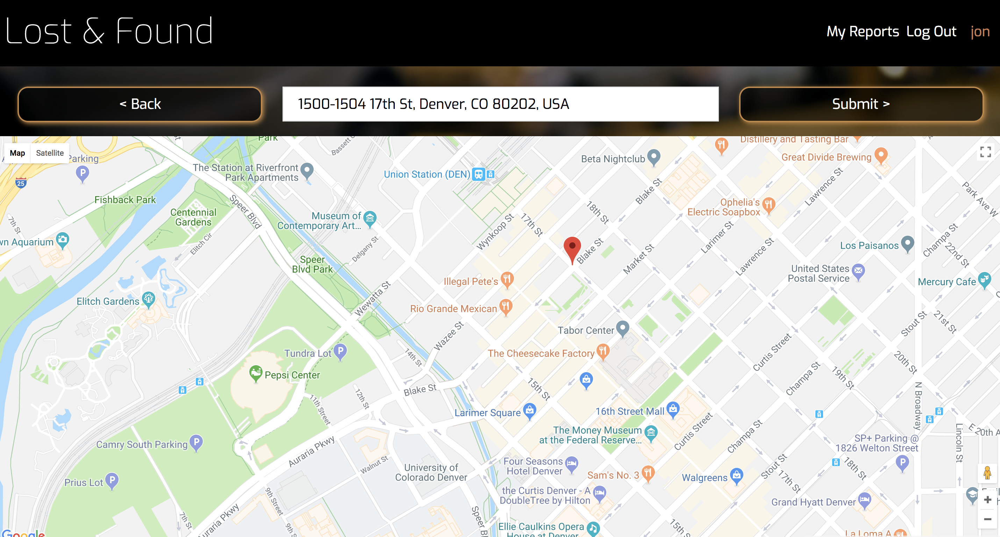
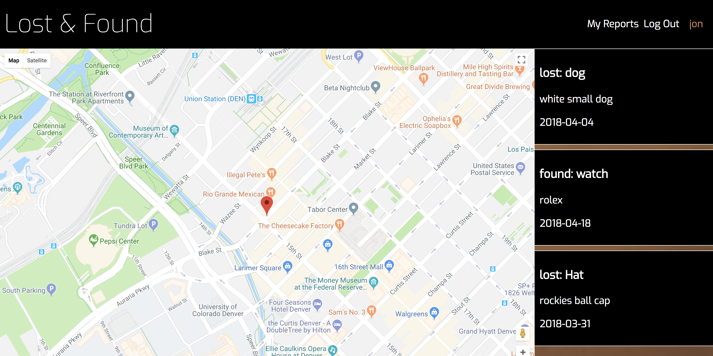

# Lost & Found
by [Jonathan Sweet](https://github.com/JSweet314/)

## Description:
This project is composed of two parts, a client side and a server side. Utilizing an express.js server with knex/postgreSQL on the backend to store user and reported item information, the front end provides an interface with React, Router, Redux, Saga middleware, and the Google Maps Javascript API to allow users to sign up, create reports, and view their reports with a dynamic, interactive map. Future versions may include public portal access that an organization can grant to search a full list of items.

## Instructions: 
This project requires the following: 
* [PostgreSQL](https://www.postgresql.org/download/) (can be installed with [Homebrew](https://brew.sh/))
* [This repo (backend server)](https://github.com/JSweet314/lostAndFound-server)

To start:
* Clone down this repo and run `npm install`
* Clone backend (server) and run `npm install`
* Start backend server with `node index.js`
* Start frontend (client) with `npm start`
  * Press 'y' to accept different port (client side is proxied to port 3000)

Run the test suite in terminal with `npm test`. 
Run eslint with `npm run eslint`.

